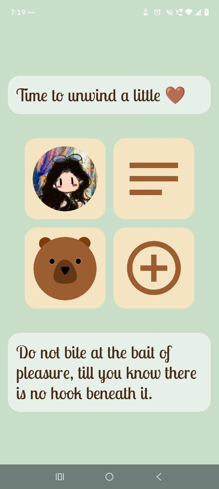
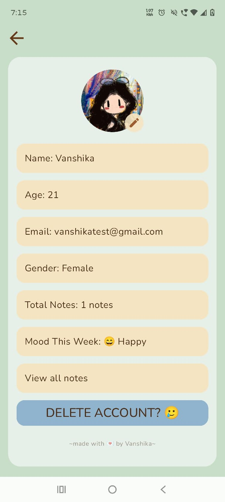

# TeddyNotes 🐻

A cozy mood-based journaling Android app with an AI companion, Teddy, who knows your story.

---

## What is TeddyNotes?

TeddyNotes is a personal journaling app built for emotional reflection. Write one note a day, tag your mood, and let Teddy — your AI bear companion — check in on you like a close friend would.

---

## Features

- **Daily Journaling** — One note per day with mood tagging. Past notes are sealed and read-only.
- **Mood Activity** — Notes are color-coded by mood across a scrollable list.
- **Teddy AI Chat** — Context-aware AI companion powered by Gemini. Teddy reads your last 4 journal entries and responds like a friend, not a therapist.
- **Mood Insights** — See your most frequent mood this week on your profile.
- **User Onboarding** — One-time setup for name, DOB, email, gender stored locally via DataStore.
- **Edit Profile** — Update your details and profile photo anytime.
- **Search Notes** — Filter your journal entries by title.
- **Offline First** — All notes stored locally using Room DB. No account needed, no cloud sync.

---

## Tech Stack

| Layer | Technology |
|---|---|
| Language | Kotlin |
| UI | Jetpack Compose |
| Navigation | Navigation Compose |
| Local DB | Room |
| User Preferences | DataStore |
| AI Chat | Firebase AI (Gemini) |
| Quote API | ZenQuotes |
| Image Loading | Coil |
| Architecture | MVVM |

---

## Architecture

```
com.example.teddynotes/
├── data/
│   ├── local/
│   │   ├── MoodConverter.kt
│   │   ├── NoteDao.kt
│   │   ├── TeddyDatabase.kt
│   │   └── UserPreferences.kt
│   └── remote/
│       ├── QuoteAPI.kt
│       └── RetrofitClient.kt
├── model/
│   ├── Message.kt
│   ├── Mood.kt
│   ├── Note.kt
│   └── QuoteResponse.kt
├── navigation/
│   ├── NavGraph.kt
│   └── NavRoutes.kt
├── repository/
│   ├── ChatRepository.kt
│   ├── NoteRepository.kt
│   └── QuoteRepository.kt
├── ui/
│   ├── chatbot/      ChatBotScreen
│   ├── common/       TeddyTopBar
│   ├── home/         HomeScreen, OnboardingDialog
│   ├── notes/        NoteScreen, MoodPickerDialog
│   ├── notes_list/   NotesListScreen
│   ├── profile/      ProfileScreen
│   ├── splash/       SplashScreen
│   └── theme/        Color, Type, Theme
└── viewmodel/
    ├── ChatViewModel.kt
    ├── HomeViewModel.kt
    ├── NoteViewModel.kt
    ├── NoteViewModelFactory.kt
    └── UserViewModel.kt
```
---

## Screenshots

| Home | Notes | Teddy Chat |
|---|---|---|
|  |  |  |

| Add Note | Profile | Note List |
|---|---|---|
|  |  |  |

---

## Setup

This app uses Firebase AI — you'll need your own Firebase project to run it.

1. Create a Firebase project at [console.firebase.google.com](https://console.firebase.google.com)
2. Add Android app with package name `com.example.teddynotes`
3. Download `google-services.json` → place in `/app` folder
4. Enable Gemini Developer API in Firebase console → AI Logic
5. Build and run

Or download the latest APK from [RELEASE](https://github.com/Vanshika-Tanwar/TeddyNotes/releases/tag/v1.0.0) to try it directly.

---

## Design

- Palette: warm bear browns, paper beige, muted greens
- Fonts: Lobster Two (display), Nunito (body)
- Cozy, calming aesthetic — not a productivity tool

---

## What I learned building this

- Jetpack Compose UI from scratch
- Room DB with TypeConverters for custom types
- DataStore for lightweight user preferences
- Prompt engineering for context-aware AI responses (RAG-lite pattern)
- MVVM architecture with StateFlow and coroutines
- Navigation Compose with typed routes

---

*made with 💌 by Vanshika*
